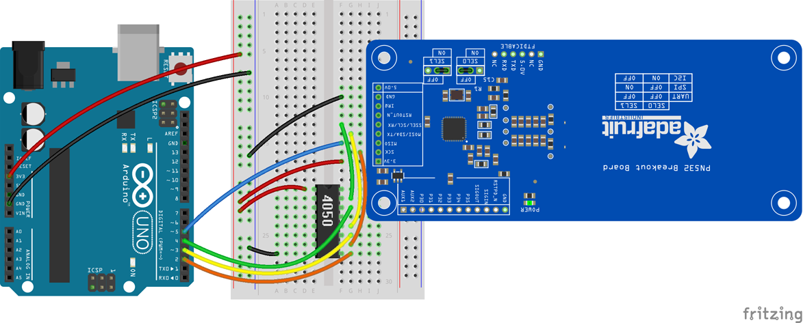

# cie-PN532
Arduino library for SPI access to the PN532 NFC chip in the Italian Electronic Identity Card (CIE).

___
**WARNING: this library does not yet detect cloned cards.**
___
## Prerequisites
This library depends upon the **Adafruit_PN532** library which you can obtain from its GitHub Repository.

https://github.com/adafruit/Adafruit-PN532

You must install both the Adafruit_PN532 and cie_PN532 in your Arduino _libraries_ directory.
Plese follow the instructions from the Arduino guide.

https://www.arduino.cc/en/Guide/Libraries


## Wiring PN532 breakout to the Arduino Uno for SPI communication
At present, just the SPI connection is supported. The examples provided will work with this wiring.



This wiring is also described in detail on this page at the Adafruit website.

https://learn.adafruit.com/adafruit-pn532-rfid-nfc/breakout-wiring

## Getting started

Create a new arduino project and set it up like this:
```C++
//Include some libraries
#include <Wire.h>
#include <SPI.h>
#include <cie_PN532.h>

//Use the cie_PN532 with the typical wiring, as pointed out above
cie_PN532 cie();

void setup(void) {
  #ifndef ESP8266
    while (!Serial); // for Leonardo/Micro/Zero
  #endif
  Serial.begin(115200);
  //Initialize the PN532 breakout board
  cie.begin();
}
```
Then, in your loop, wait for a card then read its ID_Servizi (a low-security unique identifier)

```C++
void loop(void) {
  //Let's see if a card is present
  bool cardDetected = cie.detectCard();
  if (!cardDetected) {
    //No card present, we wait for one
    delay(100);
    return;
  }

  //Good! A card is present, let's read the ID!
  word bufferLength = EF_ID_SERVIZI_LENGTH;
  byte buffer[EF_ID_SERVIZI_LENGTH];

  if (!cie.read_EF_ID_Servizi(buffer, &bufferLength)) {
    Serial.print(F("Error reading EF.ID_SERVIZI"));
    delay(1000);
    return;
  }

  //We were able to read the ID_Servizi, print it out!
  Serial.print(F("EF.ID_Servizi: "));
  cie.printHex(buffer, bufferLength);
}
```

## More examples
This library comes with an _examples_ directory. You can load and run examples from the Arduino IDE by clicking the File menu -> Examples -> cie 532.


## Useful links
 * The CIE 3.0 chip specification (italian)
 http://www.agid.gov.it/sites/default/files/documentazione/cie_3.0_-_specifiche_chip.pdf
 * Technical specification for the European Card for e-Services and National e-ID Applications
 http://www.unsads.com/specs/IASECC/IAS_ECC_v1.0.1_UK.pdf
 * Specifiche tecniche del documento digitale unificato (italian)
 http://www.agid.gov.it/sites/default/files/leggi_decreti_direttive/specifiche_tecniche_del_documento_digitale_unificato_v.1.0.0.pdf